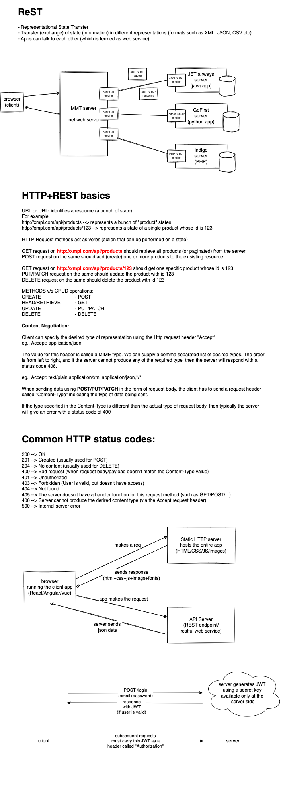

## Architectural constraints of RESTful services (APIs)

1. Service must be accessible as a uniform resource
1. Client/Server application
1. Cacheable
1. Stateless
1. Layered system
1. Code on demand (optional)

## Valid JSON

```json

{ }


{ "name" : "Vinod" }

{ "name" : "Vinod", "city" : "Bangalore" }

{ "name" : "Vinod", "age" : 48 }

{ "name" : "Vinod", "address" : { } }
{ "name" : "Vinod", "address" : { "city" : "Bangalore" } }
{ "name" : "Vinod", "address" : { "city" : "Bangalore", "state" : "Karnataka" } }

{ "name" : "Vinod", "phoneNumbers" : [ ] }
{ "name" : "Vinod", "phoneNumbers" : [ "9731424784" ] }
{ "name" : "Vinod", "phoneNumbers" : [ "9731424784", "9844083934" ] }

{ "name" : "Vinod", "isMarried" : true }

{ "name" : "Vinod", "isMarried" : null }

[ ]

[ 10, 20, 30, "Vinod", "Shyam", { "name": "Ramesh", "age": 33, "is_married": false}]


```
